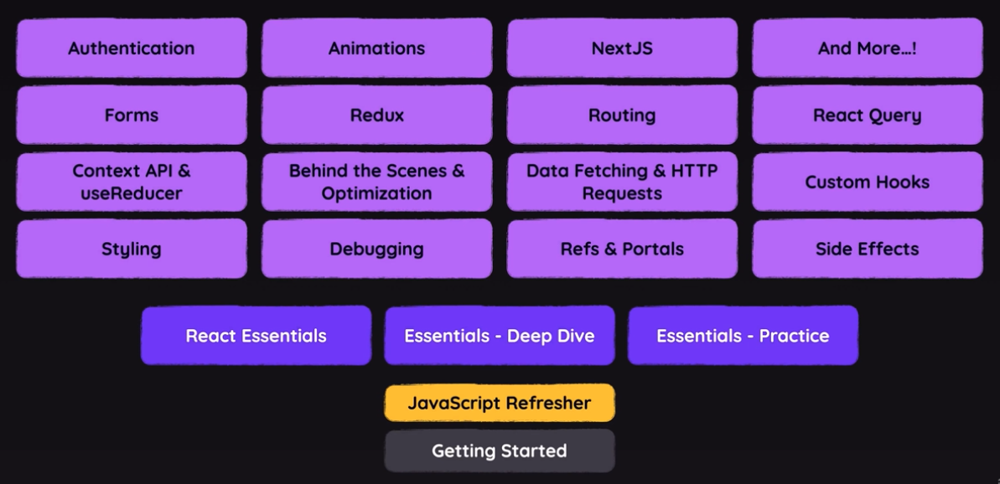

## Section 1 : Getting Started

So I told you that often using just JavaScript
isn't a great option and that instead using libraries
like React is better, because React offers
a simpler mental model and provides an easier way
of building complex web applications
and web user interfaces.
